# FoxBarcode 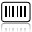

**FoxBarcode** is a 100% **Visual FoxPro** class that provides a tool for generating images with different bar code symbologies to be used in VFP forms and reports, or exported to other applications.

### Project Manager

***Guillermo Carrero** (RIP) (Barcelona, Spain) and **Luis Maria Guayan** (Tucuman, Argentina)*

  *In Memoriam **Guillermo Carrero** (Feb 05, 1961 / Jan 14, 2013)*

### Latest release

**[FoxBarcode_v_1_19](/FoxBarcode_v_1_19/)** - v.1.19 - Release 2019.05.21

### Features

**FoxBarcode** supports the following barcode symbologies: Code 128 (Auto, A, B and C), Code 39, Code 39 Extended (Full ASCII), Code 93, Code 93 Extended (Full ASCII), Standard 2 of 5, Interleaved 2 of 5, EAN-8, EAN-13, UPC-A, UPC-E (EAN and UPC with 2/5 digits supplements), ITF-14, GS1/UCC/EAN-128, Codabar, Code 11, MSI / Plessey, PostNet, MS4SCC, KIX-Code, Telepen, One Track Pharmacode and Two Track Pharmacode. Now supports QR Code with its supplement **[FoxBarcodeQR](https://github.com/VFPX/FoxBarCodeQR)**.

**FoxBarcode** supports the following image types: JPG, BMP, GIF, PNG and TIFF.

**FoxBarcode** generates the images with the class **[gpImage2](http://sites.google.com/site/gpimage2)** of **Alexander Golovlev** (Russia) and **Cesar Ch.** (Brazil), based on GDI + and requires gdiplus.dll.

**FoxBarcode** is compatible with all versions of **Visual FoxPro** from version 6.0.

### Properties

**FoxBarcode** allows greater control over the generation of bar code image to be able to customize the following properties:

*  **nImageHeight:** Height in pixels of the image.
*  **nImageWidth:** Width in pixels of the image. Now can set the property.
*  **nAlignBarcode**: Allows to align the barcode on the left, center or right of the image.
*  **nResolution:** Image resolution in DPI.
*  **nRotation:** Rotate the image. (0 = 0°, 1 = 90°, 2 = 180°, 3 = 270°)
*  **cImageType:** Type of the generated image. ("JPG", "GIF" "PNG", "BMP", "TIF")
*  **cImageFile:** Name the image file generated. If not specified, it generates a random file name in the folder Windows temporary files.
*  **cText:** Text encoding.
*  **nAlignText:** Alignment of human-readable text. (0 = Left, 1 = center, 2 = Right)
*  **lShowHumanReadableText:** .T. whether to display the human-readable.
*  **lShowCheckDigit:** .T. whether to display the check digit on the human-readable.
*  **lShowStartStopChars:** .T. if it shows the start and end characters in human-readable.
*  **cFontName:** Name of the source of human-readable.
*  **lFontBold:** .T. if the source of human-readable is Bold.
*  **lFontItalic:** .T. if the source of human-readable is Italic.
*  **nFontSize:** Font size of the human-readable. (Recommended = 8 or 9)
*  **nFontColor:** Color of the human-readable source. (Recommended = Black = RGB (0,0,0)).
*  **nBackColor:** The background color of the image. (Recommended = White = RGB (255,255,255)).
*  **nBarsColor:** Color of the bars. (Recommended = Black = RGB (0,0,0)).
*  **nBarcodeType:** Type bar code symbology. See the list of supported barcodes and ID.
*  **cSet128:** Set of Code 128. ("A", "B", "C" and AUTO with " * " chararacter)
*  **cSupplementalText:** Supplementary Text EAN and UPC codes.
*  **lAddCheckDigit:** .T. if you calculate the check digit. In symbols, where the check digit is mandatory, not taking into account this property.
*  **nBearerBar:** supporting frame type, only in the ITF-14 symbology. (0 = None, 1 = Rectangle, 2 = Top & Bottom)
*  **lUseAppId:** .T. FoxBarcode interpreter to code to GS1/UCC/EAN-128 Application Identifiers. (enclosed in parentheses)
*  **nFactor:** Magnification factor of the bar code. (1 .. 9)
*  **nMargin:** Margin around the barcode.
*  **nRatio:** Relationship between the narrow bars and wide bars in the symbols that allow it.
*  **lDeleteTempFiles:** Lets choose if delete or not the temporary folder and image files.

### Methods

For the generation of the image, only one method should be called that generates the bar code image and returns the path and file name generated:

*  **BarcodeImage(cTextToEncode, cFileNameImage, cPropertyList):** Encodes the text and returns the file path of the bar code image generated.

  All parameters are optional.

  * **cTextToEncode:** Text to encode.
  * **cFileNameImage:** Name the image file to generate. If none is specified, it generates a random file name in the folder Windows temporary files.
  * **cPropertyList:** The third parameter to set all the properties in a single line, separated by commas.

Now with the **BarcodeTest()** method we can validate the text to be encoded without the need to generate the image of the barcode:

*  **BarcodeTest(cTextToEncode, cFileNameImage, cPropertyList)**: Validate the string to encode without generating the image.

  All parameters are optional, and are the same as the **BarcodeImage()** method.

  * **cTextToEncode:** Text to encode.
  * **cFileNameImage:** As an image is not generated, this parameter is an empty string.
  * **cPropertyList:** The third parameter to set all the properties in a single line, separated by commas.

### Languages

With the help of the Community VFP translated **FoxBarcode** messages the following languages:

  <table>
    <thead>
      <tr><th>Language</th><th>Translated by</th></tr>
    </thead>
    <tbody>
      <tr><td>ENGLISH</td><td>VFPEncoding</td></tr>
      <td>SPANISH</td><td>VFPEncoding</td></tr>
      <td>CZECH</td><td>Martin Krivka</td></tr>
      <td>DUTCH</td><td>Koen Piller</td></tr>
      <td>GERMAN</td><td>Stefan Wuebbe</td></tr>
      <td>INDONESIAN</td><td>Samir H.</td></tr>
      <td>PORTUGUESE</td><td>Cesar Ch.</td></tr>
      <td>TURKISH</td><td>Ugur Yilmaz</td></tr>
      <td>FILIPINO</td><td>Glenn Gevero</td></tr>
      <td>FRENCH</td><td>Samir H.</td></tr>
      <td>SERBIAN</td><td>Michael Kopljan</td></tr>
      <td>ITALIAN</td><td>Roberto Saccomanno</td></tr>
      <td>ROMANIAN</td><td>Vilhelm-Ion Praisach</td></tr>
    </tbody>
  </table>

You just have to define compiler directive **FBC_LANGUAGE** with the desired language in the file **FoxBarcode.prg**.

<pre>#DEFINE FBC_LANGUAGE "ENGLISH"</pre>

You can add more languages translating messages in their native language and send email to: [vfpencoding@gmail.com](mailto:vfpencoding@gmail.com)

### Examples

The following is an example of code to generate an image type PNG barcode Code 128 C with a height of 100 pixels and a magnification factor 2

<pre>*-- Create object
loFbc = CREATEOBJECT("FoxBarcode")

*-- Set the properties
WITH loFbc
  .cImageType = "PNG"
  .nBarcodeType = 110 & & Code 128
  .cSet128 = "C" & & Set 128 C
  .nImageHeight = 100
  .nFactor = 2
ENDWITH

*-- Generate image
lcImagen = loFbc.BarcodeImage("123456789012")</pre>

The new third parameter to the **BarcodeImage()** method, which allows you to configure the various properties, separated by commas. The same example as above, with this new way.

<pre>
*-- Create object
loFbc = CREATEOBJECT("FoxBarcode")

*-- Generate image with the properties
lcImagen = loFbc.BarcodeImage("","",[cText="123456789012", cImageType="PNG", ;
  nBarcodeType=110, cSet128="C", nImageHeight=100, nFactor=2])
</pre>

This are some images generated with **FoxBarcode**:

Code 128 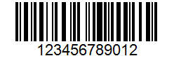

EAN-13 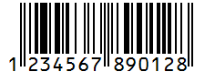

EAN-13 5-Digit Suplements 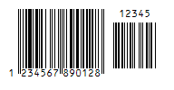

ITF-14 

EAN/UCC/GS1 128 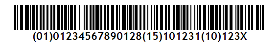

The following is an example to test if a string is valid to encode the EAN-8:

<pre>*--- Create FoxBarcode Object
LOCAL loFbc
loFbc = CREATEOBJECT("FoxBarcode")

*-- Generate a test (Ej: EAN-8 -> nBarcodeType = 150)
IF loFbc.BarcodeTest("123456", "", [nBarcodeType = 150]) 
  MESSAGEBOX(["] + loFbc.cText + ["] + " Ok", 64, "Example BarcodeTest()")
ELSE
  MESSAGEBOX(loFbc.cMsgError, 16, "Example BarcodeTest()")
ENDIF</pre>

To include a barcode on a form, you must insert an Image object. As the bar code image does not exist at design time, the Picture property takes the name of the image when calling the **BarcodeImage()** method, for example from the Refresh method of form, as shown in the figure below:

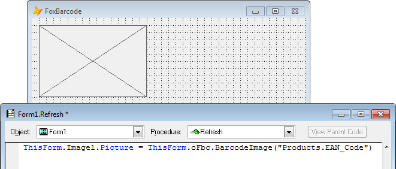

To include a barcode on a report, you must insert an Image object and set the property with a call ControlSource **BarcodeImage()** method and is recommended to set "contents Scale, Retain shape" if the image size differs from the frame.

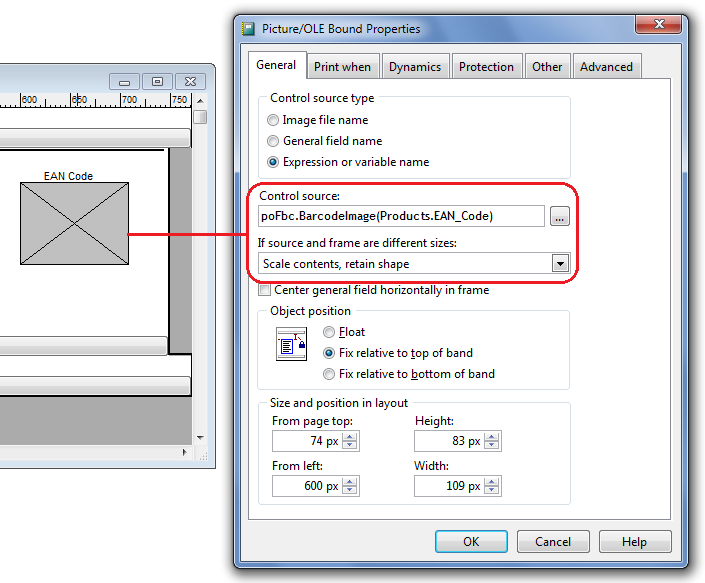

**Important:** Before you run the report and create the object **FoxBarcode**, you must declare the variable as **PRIVATE** so that it has scope in the report, as follows:

<pre>PRIVATE poFbc
poFbc = CREATEOBJECT("FoxBarcode)
...
REPORT FORM MyReport</pre>

### Distribution

The only files needed to be distributed to **FoxBarcode** function properly are:

*  FoxBarcode.prg
*  gpImage2.prg

These files are located in the Source folder included in the download file.

Before instantiating the class **FoxBarcode**, you must run the following statements:

<pre>SET PROCEDURE TO LOCFILE("FoxBarcode.prg"), LOCFILE("gpImage2.prg") ADDITIVE</pre>

### Demo Form

With the download of **FoxBarcode** is a sample form, from which we can generate bar codes to our needs, and a builder of code, from which we can copy the generated code to the clipboard ready for pasting into your application.

At the top of the form there are three tabs from which all properties are configured class **FoxBarcode**.

From the tab **"Barcode properties"** you enter the text to encode, the kind of symbolism and if **FoxBarcode** calculates the check digit. The dimensions of the image of the bar code to configure: the magnification factor, the around margin barcode, the height of the image, and the ratio of narrow and wide bar (in the symbols that allow for such variation) . The rotation of the bar code is also set from this tab, as well as some special properties of certain symbols.

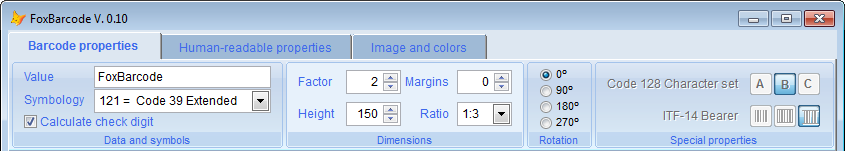

When we go through the list of symbols, is a brief description of the selected symbols, valid characters and their more common.

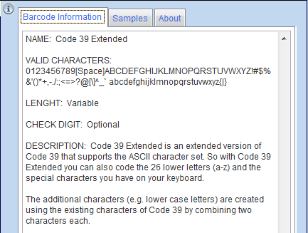

On the tab **"Human-readable properties"** to configure the human-readable text, whether it will be shown, whether to display the check digit and if it shows the characters of Start and End of the symbols. The font, justification, the size and color are set in this tab.

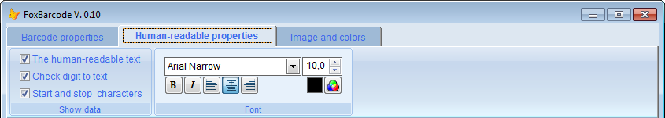

The tab **"Image and colors"** shows us the full name of the image file, this property can be passed as parameter or **FoxBarcode** class generates a random file name. Here we set the image type, resolution (DPI), the background color and the color of the bars.

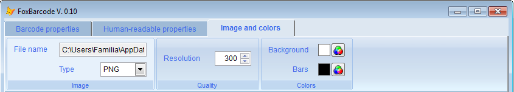

Once you've set the properties, you can click on the button **"Script Builder"** and **FoxBarcode** automatically generates the necessary code to cut and paste in your application.

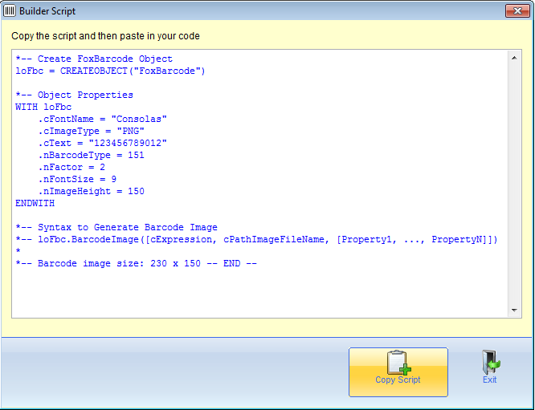

### Links

* Mire mas ejemplos: **[En español](http://sites.google.com/site/foxbarcode)**
* Voir d'autres exemples: **[En français](http://www.vfp.fr/foxbarcode.asp)**

### Acknowledgements

* To our families.
* To **Cesar Ch.** for your continued ideas and collaborations with their classes **gpImage2** and **FoxyPreviewer**.

### FoxBarcode FAQs

***I can read the images generated by FoxBarcode?***

  Yes, with the following readers online:

  * http://online-barcode-reader.inliteresearch.com
  * http://www.onlinebarcodereader.com
  * http://zxing.org/w/decode.jspx

***Can you rotate bar codes generated?***

  Yes, changing the value of the nRotation property. Valid values are: 0 -> 0°, 1 -> 90°, 2 -> 180° and 3 -> 270°.

***Why the error "OLE error code 0x800A0046"?***

  This is a bug in VFP Image object and images different JPG and BMP formats. A workaround is to write the following code in the Destroy method of the Image object:

  <pre>THIS.PICTURE = ""</pre>

***Why does the scanner does not read the code generated by FoxBarcode?***

  If printing is not good, increases the value of the nFactor property to 2 or more.

  Also make sure the scanner is correctly configured to read the bar code symbology selected.

***The human-readable is not clear***

  Use the image format PNG or BMP. Setting the property cImageType = "BMP" or "PNG"

***FoxBarcode Supports QR Code?***

  Currently supports the QR Code with the supplement **[FoxBarcodeQR](https://github.com/VFPX/FoxBarCodeQR)** which uses the free library **BarCodeLibrary.DLL** of ***Dario Aranda Alvarez** (Mexico)*

### What's New?

**v.1.19 - Release 2019.05.21**
* Improvements in the GS1-128 code with the AIs (Application Identifiers) of fixed and variable length.

**v.1.17 - Release 2016.12.21**
* New language: ROMANIAN by Vilhelm-Ion Praisach
* Version number matched to FoxBarcodeQR an New Year !
* Fixed some minor bugs

**v.1.12 - Release 2013.09.08**
* New "Set Auto" for Code 128 that optimize strings containing many numbers

**v.1.11 - Release 2013.08.24**
* New property lDeleteTempFiles: Lets choose if delete or not the temporary folder and image files
* Fixed some minor bugs

**v.1.10 - Release 2012.06.03**
* New language: ITALIAN by Roberto Saccomanno
* Changes in nImageWith property: now can set the width of the image 
* New property nAlignBarcode: allows you to align the barcode on the left, center (default) or right of the image. 
* Fixed some minor bugs

**v.1.00 - Release 2011.12.26**
* Released for production
* Check and correct all the variables to support mdot
* Fixed some minor bugs

**v.0.16 - Released 2011.08.28**
* Messages in multiple languages:
  * ENGLISH
  * SPANISH by VFPEncoding
  * CZECH by Martin Krivka
  * DUTCH by Koen Piller
  * GERMAN by Stefan Wuebbe
  * INDONESIAN by Samir H.
  * PORTUGUESE by Cesar Chalom 
  * TURKISH by Ugur Yilmaz
  * FILIPINO by Glenn Gevero
  * FRENCH by Samir H.
  * SERBIAN by Michael Kopljan
* New symbologies:
  * RM4SCC (Royal Mail Barcode)
  * KIX-Code (Dutch Postal)
* New BarcodeTest() method to validate the string to encode without generating the image. 
* Fixed some minor bugs

**v.0.15 - Released 2011.06.05**
* Two new symbologies:
  * One Track Pharmacode (used in the pharmaceutical industry) 
  * Two Track Pharmacode (used in the pharmaceutical industry)
* Enhancements to the code and examples

**v.0.14 - Released 2011.02.19**
* Fixed display correctly the check digit in code Interleved 2 of 5. Thanks Vishal Anand (India)
* Fixed variable names in functions Float2Int() and Int2Float() by Anatoly Mogylevets (Canada)

**v.0.13 - Released 2011.01.04**
* Enhancement in the algorithm to generate the symbology EAN/UCC/GS1-128 
* Fixed the choice of a font compatible with GDI+ to display warning messages 
* Fixed some minor bugs

**v.0.12 - Released 2010.11.29**
* New symbologie EAN/UCC/GS1-128 
* Validation of fonts families and fonts styles permitted in Gdi+. Thanks to Koen Piller (Netherlands) and Cesar Chalom (Brazil)

**v.0.11 - Released 2010.11.22**
* Added a third parameter to the BarcodeImage() method 
* Fixed some minor bugs

**v.0.10 - Released 2010.11.19**
* Symbologies: Code 128, Code 39, Code 39 Extended, Code 93, Code 93 Extended, Standard 2 of 5, Interleaved 2 of 5, EAN-8, EAN-13, ITF-14, UPC-A, UPC-E, Codabar, Code 11, MSI / Plessey, PostNet and Telepen 
* Image types: JPG, BMP, GIF, PNG and TIFF
